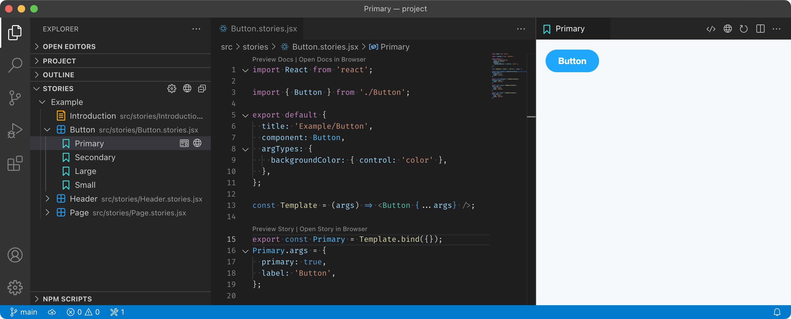

# Story Explorer

  

A VS Code extension that lets you browse and preview stories with [Storybook](https://storybook.js.org), right inside your editor.

**[Install from the Visual Studio Marketplace](https://marketplace.visualstudio.com/items?itemName=joshbolduc.story-explorer)**

## Features

**Browse your project's stories via a dedicated sidebar view**. See all of your stories at a glance and quickly jump to their source. You don't even need to start a Storybook server.

**See live previews of your stories directly within your editor**. Focus on one, or open several side-by-side and see how they change as you code. And it works for docs, too. Story Explorer can automatically start a Storybook development server on-demand, or you can point it toward one you launch yourself.

Plus:

- **Open stories and docs via CodeLens**
- **Jump to story source from a story preview** for easy navigation
- **Launch stories in an external browser** when you want the full Storybook environment
- **Get Intellisense suggestions** for story titles

## Settings

### `storyExplorer.codeLens.docs.enabled`

Controls whether to display CodeLens results for docs. When enabled, CodeLens results for docs appear at the top of story files.

### `storyExplorer.codeLens.stories.enabled`

Controls whether to display CodeLens results for stories. When enabled, CodeLens results for stories appear above story definitions.

### `storyExplorer.logLevel`

Log level to use for logging. Logs are available via the Story Explorer output channel in the output panel.

### Options

- `none`: Do not log

- `error`: Log errors only

- `warn`: Log warnings and errors

- `info`: Log general operational information, warnings, and errors

- `debug`: Log debugging information, general operational information, warnings, and errors

### `storyExplorer.server.external.url`

URL of an externally launched and managed Storybook instance, used when [`storyExplorer.server.internal.enabled`](#storyexplorerserverinternalenabled) is disabled. Defaults to `http://localhost:6006`.

### `storyExplorer.server.internal.behavior`

Controls when to automatically start a Storybook development server. This setting only applies when [`storyExplorer.server.internal.enabled`](#storyexplorerserverinternalenabled) is enabled.

### Options

- `immediate`: Start the server automatically when opening the workspace.

- `deferred`: Wait to start the server automatically until a story preview is opened.

### `storyExplorer.server.internal.commandLineArgs`

⚠️ _**Deprecated:** This option has been replaced with [`storyExplorer.server.internal.startStorybook.args`](#storyexplorerserverinternalstartstorybookargs). If you used this option to run a script other than `start-storybook`, consider switching to a different launch strategy._

Array of command line arguments to pass to the `start-storybook` script.

### `storyExplorer.server.internal.custom.args`

Array of command line arguments to pass to the custom script. Only used when [`storyExplorer.server.internal.launchStrategy`](#storyexplorerserverinternallaunchstrategy) is set to `custom` or `detect`.

### `storyExplorer.server.internal.custom.path`

Path to a custom script used to start the Storybook development server. Only used when [`storyExplorer.server.internal.launchStrategy`](#storyexplorerserverinternallaunchstrategy) is set to `custom` or `detect`.

### `storyExplorer.server.internal.enabled`

Controls whether to enable the internal Storybook development server. When unchecked, you will have to run the server externally.

### `storyExplorer.server.internal.environmentVariables`

Object with environment variables that will be added to the Storybook server process.

### `storyExplorer.server.internal.launchStrategy`

The method to use to launch the Storybook development server.

### Options

- `detect`: Detect automatically

- `npm`: Run an npm script

- `storybook`: Run `storybook dev` directly, for use with Storybook 7

- `start-storybook`: Run `start-storybook` directly, for use with Storybook 6

- `task`: Run a VS Code task

- `custom`: Run a custom command

### `storyExplorer.server.internal.npm.dir`

Optional path to the directory containing the `package.json` file with the npm script to use. If your workspace contains multiple `package.json` files with the same script name, you can set this to specify which one to use. Only used when [`storyExplorer.server.internal.launchStrategy`](#storyexplorerserverinternallaunchstrategy) is set to `npm` or `detect`.

### `storyExplorer.server.internal.npm.script`

Name of the npm script to use to launch the Storybook development server. Defaults to `storybook`. Only used when [`storyExplorer.server.internal.launchStrategy`](#storyexplorerserverinternallaunchstrategy) is set to `npm` or `detect`.

### `storyExplorer.server.internal.startStorybook.args`

Array of command line arguments to pass to the `start-storybook` script. Only used when [`storyExplorer.server.internal.launchStrategy`](#storyexplorerserverinternallaunchstrategy) is set to `start-storybook` or `detect`.

### `storyExplorer.server.internal.startStorybook.path`

Path to the `start-storybook` script used to start the Storybook 6 development server. By default, Story Explorer will attempt to auto-detect the path inside `node_modules`. Only used when [`storyExplorer.server.internal.launchStrategy`](#storyexplorerserverinternallaunchstrategy) is set to `start-storybook` or `detect`.

### `storyExplorer.server.internal.storybook.args`

Array of command line arguments to pass to the `storybook` CLI when launching a development server. The `dev` argument is always included. Only used when [`storyExplorer.server.internal.launchStrategy`](#storyexplorerserverinternallaunchstrategy) is set to `storybook` or `detect`.

### `storyExplorer.server.internal.storybook.path`

Path to the `storybook` CLI used to start the Storybook 7 development server. By default, Story Explorer will attempt to auto-detect the path inside `node_modules`. Only used when [`storyExplorer.server.internal.launchStrategy`](#storyexplorerserverinternallaunchstrategy) is set to `storybook` or `detect`.

### `storyExplorer.server.internal.storybookBinaryPath`

⚠️ _**Deprecated:** This option has been replaced with [`storyExplorer.server.internal.startStorybook.path`](#storyexplorerserverinternalstartstorybookpath). If you used this option to run a script other than `start-storybook`, consider switching to a different launch strategy._

Path to the `start-storybook` script used to start the Storybook development server. By default, Story Explorer will attempt to auto-detect the path inside `node_modules`.

### `storyExplorer.server.internal.task.label`

Label of the task to run to launch the Storybook development server. Only used when [`storyExplorer.server.internal.launchStrategy`](#storyexplorerserverinternallaunchstrategy) is set to `task` or `detect`.

### `storyExplorer.server.internal.task.type`

Optional type of the task to run to launch the Storybook development server. Only used when [`storyExplorer.server.internal.launchStrategy`](#storyexplorerserverinternallaunchstrategy) is set to `task` or `detect`.

### `storyExplorer.storiesGlobs`

Globs specifying the location of stories in the project relative to the workspace root. By default, stories globs are read from the Storybook configuration file. If specified, this takes precedence over the Storybook configuration file.

### `storyExplorer.storiesView.showItemsWithoutStories`

Controls whether to display story kinds in the stories view that do not contain any valid stories. These items do not appear in Storybook.

### `storyExplorer.storybookConfig.docs.autodocs`

Overrides the `docs.autodocs` portion of the Storybook configuration. This property configures auto-generated documentation pages.

### Options

- `null`: Use the same settings as detected in the Storybook configuration file

- `tag`: Show auto-generated documentation entries for files with the `autodocs` tag

- `true`: Show auto-generated documentation entries for all files

- `false`: Do not show auto-generated documentation entries

### `storyExplorer.storybookConfig.docs.defaultName`

Overrides the `docs.defaultName` portion of the Storybook configuration. This property controls the name of the auto-generated documentation page.

### `storyExplorer.storybookConfigDir`

Location of the Storybook configuration directory containing `main.js`. By default, Story Explorer will attempt to auto-detect a `.storybook` configuration directory that contains a `main.js` file. If your configuration directory is named something other than `.storybook` or your workspace contains more than one configuration directory, you should manually specify a path to the configuration directory you wish to use.

### `storyExplorer.suggestStoryId`

Controls whether to offer suggestions for story IDs when using `<Story id="..." />` in MDX files. Suggestions are based on the IDs of other stories in the project.

### `storyExplorer.suggestTitle`

Controls whether to offer suggestions for titles when specifying a `Meta` object in CSF or MDX files. Suggestions are based on other titles used in the project.

## Limitations

### Static analysis

Much like [Storybook's `storyStoreV7`](https://storybook.js.org/docs/react/configure/overview#feature-flags) (which is enabled by default in Storybook 7), Story Explorer uses static analysis to identify stories and extract metadata from source files.

Static analysis is faster and safer than running arbitrary code, but its evaluation capabilities are more limited. As a result, its behavior may differ from what happens at runtime.

In practice, if your project is compatible with Storybook's `storyStoreV7`, it should be fully supported. Even if your project isn't fully compliant with `storyStoreV7`, you may not notice any discrepancies.

However, if you rely on nontrivial runtime behavior when defining or naming stories, they may not be recognized correctly.

### Unsupported features

Some advanced Storybook features aren't supported, including:

- [Story indexers](https://storybook.js.org/docs/react/configure/sidebar-and-urls#story-indexers)
- [`storySort` configuration](https://storybook.js.org/docs/react/writing-stories/naming-components-and-hierarchy#sorting-stories)
- [Sidebar options set via `addons.setConfig`](https://storybook.js.org/docs/react/configure/features-and-behavior) (including `collapsedRoots` and `renderLabel`)

### CSF and MDX only

Story Explorer supports:

- [Component Story Format](https://storybook.js.org/docs/react/api/csf) (CSF) stories, including:
  - CSF 1.0
  - [CSF 2.0 with hoisted CSF annotations](https://github.com/storybookjs/storybook/blob/next/MIGRATION.md#hoisted-csf-annotations)
  - [CSF 3.0 object stories](https://storybook.js.org/blog/component-story-format-3-0/)
- [MDX](https://storybook.js.org/docs/react/api/mdx) stories and docs (v1 and v2).

The legacy `storiesOf` API is not supported.

### Cross-origin restrictions

Story previews are rendered in an `iframe` embedded in a VS Code `webview`. This imposes some restrictions inherent to the use of cross-origin `iframe`s.

For example, attempts to access `window.top` in a story will cause an exception to be thrown. This can interfere with the official actions addon.

Story Explorer attempts to suppress any uncaught exceptions so that they don't interfere with the preview, but some functionality may not work as expected. You can always open stories in an external browser instead of the built-in preview.

### Limited addon support

Story previews use isolated views of each story. These previews don't include the toolbar or addon panels, so addons that decorate the manager, such as controls, actions, and backgrounds, aren't available.

### Trusted workspaces required

Story Explorer currently doesn't work with [untrusted workspaces](https://github.com/microsoft/vscode/issues/106488).
